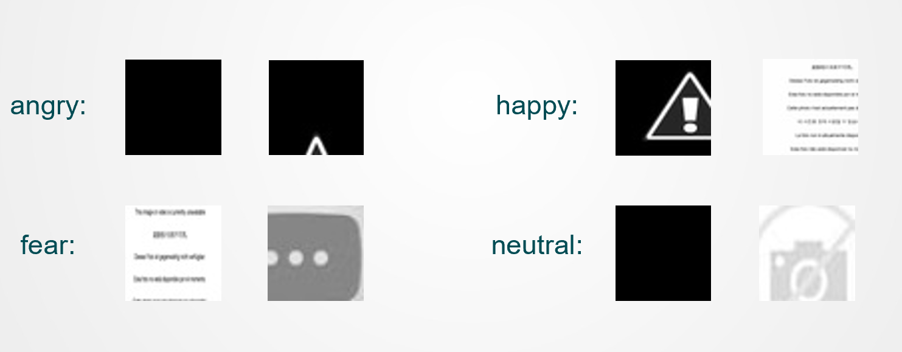

# BUAA_ML_FER
## 人脸表情分类

### 一、项目概述

**简介**：人脸表情数据集中包含7类表情，请根据图片特征对人脸分类。
**任务目标**：将测试集的人脸划分为上图7类。
**数据集**：训练集28709，测试集7178，图片大小为48x48。
**评价指标**：Accuracy=正确个数/图片总数

**项目链接**：https://github.com/0-KaiKai-0/BUAA_ML_FER

人脸表情分类是一个典型的监督学习的分类任务。我们通过在训练集上训练模型，实现对测试集中图像标签的预测。

### 二、数据处理

#### 2.1 数据集划分

对于28709张训练集图片（之后数据清洗中又删去了40张左右图片），我在自行实验中随机划分24000张作为训练集，剩下的作为验证集。

#### 2.2 数据加载

通过继承Dataset封装了

- FaceExpressionLoader: 加载所有训练集样本（所有的七类）；
- ExplicitExpressionLoader: 加载某一类训练集样本（用于类原型网络的实验中）；
- TestExpressionLoader: 加载所有测试集样本。

读取图像时会将图像转化为灰度值矩阵，并按高斯分布进行归一化。

### 三、Backbone: ResNet

#### 3.1 模型选择

对于本题，我选择了深度神经网络的方法。首先，我自行搭建了一个简单的多层卷积神经网络（CNN），但在验证集上的表现一般，经过一些调参和修改架构，同时了解到现有的比较成熟的网络AlexNet, VGGNet, ResNet等，于是最终还是决定使用ResNet作为模型的Backbone。

深度神经网络中存在着退化问题：随着网络深度的增加，网络准确度出现饱和，甚至会下降。而ResNet（Deep residual network）通过学习图像特征中的残差项来解决深度神经网络的退化问题。

我主要参考Pytorch官方文档自行搭建了ResNet深度神经网络[^1]。因为我们的分类问题较为简单，使用过于复杂的网络会增加计算的开销，同时又未必能提升预测的准确度，因此，后面的实验基本集中在ResNet18和ResNet34上。

#### 3.2 模型实现

ResNet18和ResNet34中核心为计算残差的两层卷积的基本块（结构如下图所示）。

再由基本块组成layer层，由layer层拼接成模型，并在最后加上全连接层作为分类层（结构如下图所示）。

### 四、实验与优化

仅仅使用ResNet肯定是不够的，这在验证集上的准确率只有55%左右。于是我还进行了以下的实验与优化。

#### 4.1 数据增强

如果在不同迭代中重复使用相同的图像很容易学到过于细节的特征，从而导致过拟合。因此需要对训练集的图像进行数据增强的操作。

- 随机裁剪：样本原图大小是48x48的，尝试了42x42, 44x44, 46x46, 48x48(padding=2), 48x48(padding=4)等多种方案后选择了48x48(padding=2)的裁剪方法，即以0.5的概率先在原图的四周补上宽度为2的边框得到52x52的图像，再随机裁剪出48x48的图像作为训练样本。
- 属性变化：将图像的亮度和对比度随机变化为原来的0.5~1.5倍。
- 随机水平翻转：以0.5的概率对图像进行水平翻转。

#### 4.2 数据清洗

仔细观察所给的训练集图片，会发现其中有不少与标签不符的图片。比如如下一些例子：

这些错误样本会给模型带来一定的干扰。于是可以先对数据集进行预处理来清洗掉这些错误样本。

观察到这些错误样本中灰度的变化是很小的（全黑、全白或者只有很少的信息点），于是我遍历每张训练集图片，计算其灰度值矩阵的标准差，小于10的可以认为是错误样本（见**preprocess.py**），再进行人工选择，由此可以清洗掉40张左右的错误样本。

在查找资料时也了解到没有错误样本的fer2013+数据集，但考虑到本任务既然已经给定数据集，换用更优的数据集除了能提升准确率并没有什么实际意义，所以没有采用fer2013+。

#### 4.3 优化器

在实验中主要对于SGD和Adam两种优化器进行调参，最终使用SGD优化器，初始学习率为0.01，每9个epoch就将学习率减小到0.4倍。同时设置weight_decay为0.00001来在损失中增加L2正则项，减小过拟合。

#### 4.4 损失函数

开始时使用CrossEntropyLoss，并且考虑到训练集**样本分布的不均衡**（如下表所示），为样本数较多的类别设置较低的损失权重，为样本数较多的类别设置较高的损失权重。

| 类别 | angry | disgust | fear | happy | neutral | sad  | surprise |
| :--: | :---: | :-----: | :--: | :---: | :-----: | :--: | :------: |
| 数量 | 3995  |   436   | 4097 | 7215  |  4965   | 4830 |   3171   |

之后经过查找资料和进行实验，改用了标签平滑的损失函数（见**loss.py**）。

对于多分类任务，正确标签的值为1， 错误标签的值为0。而经过Label Smoothing后，给定类别数classes=7以及超参数smoothing（最终设定为0.05），更新的标签向量为
$$
y_i=\begin{cases}1-smoothing,i=target\\ \frac{smoothing}{classes-1},i\ne target\end{cases}
$$
对标签向量进行平滑后一方面可以避免过拟合，提高模型的泛化能力；另一方面可以减小错误样本的影响，提升模型的鲁棒性。

#### 4.5 类原型网络

原型网络（Prototypical Networks）是一种小样本学习（Few-Shot Learning）中的模型，本质上是一种聚类的思想（见**train.py**和**test.py**）。

原型网络将每个类别中的样例数据映射到一个空间当中，并且提取他们的“均值”来表示为该类的原型（prototype）。使用欧几里得距离作为距离度量，训练使得本类别数据到本类原型表示的距离为最近，到其他类原型表示的距离较远。测试时，对测试数据到各个类别的原型数据的距离做softmax，来判断测试数据的类别标签。

而本任务是一个有标签的自监督学习任务，先用训练集样本训练模型，再将各个类别的样本输入到训练好的模型中，算出每个类别的特征中心，即**原型**，在测试时计算测试集样本与七个原型的相似度评分，通过评分预测出测试集样本标签。

但在实验中发现该方法并不能提升分类的准确度，因此也就没有过多展开了

#### 4.6 其他实验与调参

##### 4.6.1 调整模型架构

（1）如前所述，ResNet模型中有四个layer层，而我们预测标签时使用的只有最后一层，因此也尝试了将中间层得到的特征与最后一层得到的特征作加权平均来进行分类。

（2）调整ResNet中最后全连接层为2层、3层的网络结构。

（3）在layer层、全连接层等连接处加入Dropout层。

经过以上一些模型架构调整的尝试，并不能使模型表现得到提升。

##### 4.6.2 归一化

为了加快神经网络训练时的收敛速度以及使样本更符合统计分布性，在读入图像时，需要对灰度值矩阵进行归一化。

我计算出训练集样本灰度（0~1）的均值为0.5057，标准差为0.2552（见**preprocess.py**），同时也随机选取了一些值。最后发现当样本归一化到N(0.15, 0.4)的分布时，模型的表现最好。

##### 4.6.3 mini_batch

本任务训练集中的样本较为充足，经过实验最终选定batch_size为63。

### 五、结果[^2]

**排名**：4

**准确率**：0.6882

[^1]: https://pytorch.org/docs/stable/_modules/torchvision/models/resnet.html#resnet34
[^2]: 截止于2021年1月6日20:44，两个任务的排名如报告中所述
